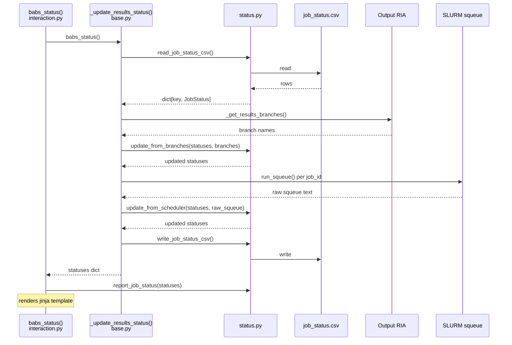

# babs status simplification

## Problems

1. **`is_failed` computed in 3 separate places** with inconsistent pandas
   dtype handling. This has already caused a real bug: a completed job with
   results gets counted as both succeeded AND failed (confirmed on cluster).

2. **Pandas dtype footguns.** `has_results` was changed from `dtype='boolean'`
   to `dtype=object` (Python bools) to fix a test assertion. Bitwise NOT on
   object-dtype `True` gives `-2` (truthy) instead of `False`. NaN handling
   requires `.fillna(False)` and `.astype('boolean')` scattered throughout.

3. **Magic strings for scheduler state.** States like `'PD'`, `'R'`, `'CG'`
   are bare strings compared via `.isin()` — no type safety, easy to typo.

4. **Derived state stored in CSV.** `is_failed` is written to `job_status.csv`
   then re-derived on every read, creating opportunities for staleness and
   inconsistency.

5. **Prior refactor attempt failed.** PR #302 (Matt) tried to replace pandas
   with Python objects but broke logic and was never merged — it still used
   pandas for I/O and stored `is_failed` instead of deriving it.

## Goal

Drop pandas from `babs status`. Replace DataFrames with dataclasses + dicts,
`csv` module instead of pandas I/O, enums instead of magic strings, and
derive `is_failed` in one place instead of three.

## Related PRs (for context, not on this branch)

- https://github.com/PennLINC/babs/pull/354 — `babs status --wait`
  (branch: `mechababs-working-branch`). Has the dtype bug described above.
- https://github.com/PennLINC/babs/pull/302 — Matt's WIP (see problem #5).

## Tien's input (2026-04-02)

- Prior pd-removal attempt broke logic, was never merged
- Current babs status "isn't in a great state"
- Happy to review a simpler solution

## Data flow

### External sources

1. **Git branches in output RIA** → `has_results` (via `_get_results_branches()`)
2. **Zip files in analysis dir** → `has_results` (via `_get_merged_results_from_analysis_dir()`)
   - TODO: in practice finds nothing — `babs merge` pushes to output RIA,
     zips don't end up in analysis dir. Confirmed on live cluster.
3. **squeue** → scheduler state (`PD`/`R`/`CG`/`CF`) (via `run_squeue()`)
4. **job_status.csv** → persisted state
   - `submitted` — not derivable from external sources
   - `has_results` — also persisted, branches deleted after `babs merge`

### Processing flow (after this refactor)



### Data out

`report_job_status()` counts from the statuses dict and renders a jinja
template: total_jobs, total_submitted, total_is_done, total_pending,
total_running, total_failed.

## Design

### Data model

```python
class SchedulerState(Enum):
    NOT_SUBMITTED = "NOT_SUBMITTED"
    PENDING = "PD"
    RUNNING = "R"
    COMPLETING = "CG"
    CONFIGURING = "CF"
    DONE = "DONE"           # left scheduler, exit code unknown
    # future: COMPLETED, FAILED, CANCELLED, TIMEOUT (from sacct)

@dataclass
class JobStatus:
    sub_id: str
    ses_id: str | None
    scheduler_state: SchedulerState
    has_results: bool
    job_id: int | None
    task_id: int | None
    time_used: str
    time_limit: str
    nodes: int
    cpus: int
    partition: str
    name: str

    @property
    def is_failed(self) -> bool:
        return (self.scheduler_state == SchedulerState.DONE
                and not self.has_results)

    @property
    def submitted(self) -> bool:
        return self.scheduler_state != SchedulerState.NOT_SUBMITTED

    @property
    def key(self) -> tuple:
        if self.ses_id is not None:
            return (self.sub_id, self.ses_id)
        return (self.sub_id,)
```

Scheduler fields (`job_id`, `task_id`, `time_used`, etc.) are kept because
the CSV is a useful artifact — job duration, partition, and node info help
with debugging even after jobs complete.

### CSV as artifact, not source of truth

- **Write**: include `is_failed`, `submitted`, and all scheduler fields for
  human readability and debugging.
- **Read**: ignore `is_failed` and `submitted` columns; recompute from
  `scheduler_state` + `has_results`. Self-heals if CSV is stale.
- The CSV persists two bits of state destroyed by later operations:
  `submitted` (scheduler forgets completed jobs) and `has_results`
  (branches deleted after `babs merge`).

### Architecture

All status logic lives in `babs/status.py`:

```
status.py
├── Types: SchedulerState, JobStatus
├── CSV I/O: read_job_status_csv(), write_job_status_csv()
├── Update: update_from_branches(), update_from_scheduler()
└── Init: create_initial_statuses()
```

Update functions are pure data in → data out:
- `update_from_branches(statuses, branches: list[str]) -> dict`
  Parses branch names and joins with existing statuses in one step.
  No intermediate BranchInfo type.
- `update_from_scheduler(statuses, raw_squeue: str) -> dict`
  Parses raw squeue text and joins with existing statuses in one step.
  No intermediate SchedulerEntry type. Parse + join together so we never
  have unstructured data floating around without sub/ses attached.

`scheduler.py` becomes thin:
- `run_squeue(queue, job_id=None) -> str` — runs command, returns raw stdout.
  Format string and command flags stay here. Parsing moves to `status.py`.

`base.py` orchestrates:
- `_update_results_status()` reads CSV, calls `update_from_branches`,
  calls `update_from_scheduler`, writes CSV. Returns the dict so
  `babs_status()` can pass it directly to `report_job_status()`.

### User-visible changes

1. **Bug fix**: ghost-job bug gone (completed job with results no longer
   counted as failed when squeue is empty)
2. **`run_squeue` requires `job_id`** — previously defaulted to `None`,
   which queries all user jobs. Made required to prevent accidental
   full-queue queries (e.g. a future `--wait` polling loop would block
   on unrelated jobs) and because non-array jobs from other projects
   would crash the strict array format parser.

CSV format is unchanged — same columns, same order, same values.
Internally `SchedulerState` enum distinguishes NOT_SUBMITTED from DONE,
but both serialize to empty `state` column (disambiguated by `submitted`
on read). No migration needed for existing projects.

### Scope

**What changed:**
- DataFrames → dataclasses + dicts
- Three `is_failed` computations → one property
- Magic strings → enums
- pandas CSV I/O → `csv` module
- squeue parsing moved from `scheduler.py` to `status.py`
- Update logic moved from `utils.py` to `status.py`

**What did NOT change:**
- What the input streams check or how they check it
- The merge flow (`babs/merge.py`)
- The report template
- `job_submit.csv` (touched only where required at boundaries)
- `babs_submit()` still uses DataFrames internally

### Principles

- `is_failed` computed in exactly one place (the property)
- `submitted` derived from `scheduler_state != NOT_SUBMITTED`
- Enums instead of magic strings
- `csv` module instead of pandas for I/O
- No intermediate unstructured types — parse and join in one step
- CSV is artifact for humans, not source of truth
- `has_results` persisted in CSV (branches deleted after merge)
- Future-proof for sacct (replace DONE with real terminal states)

## What was done

### New file
- `babs/status.py` — data model, CSV I/O, update logic, initialization

### Modified
- `babs/utils.py` — removed `update_results_status()`,
  `update_job_batch_status()`, `results_branch_dataframe()`,
  `results_status_default_values`
- `babs/base.py` — `_update_results_status()` is now a thin orchestrator
  using `status.py`. Unused imports removed.
- `babs/interaction.py` — `babs_status()` uses returned dict directly
- `babs/scheduler.py` — added `run_squeue() -> str`.
  `report_job_status()` accepts `dict[tuple, JobStatus]`.
- `babs/bootstrap.py` — `_create_initial_job_status_csv()` uses
  `create_initial_statuses()` + `write_job_status_csv()`
- `babs/update.py` — `_update_job_status_with_new_inclusion()` uses
  dict add/remove instead of DataFrame merge

### Tests
- `tests/test_status.py` — new: model, CSV round-trip, update logic,
  report counting. Pure data in → data out, no mocks.
- `tests/test_utils.py` — removed tests for deleted functions
- `tests/test_babs_workflow.py` — added CSV assertions at key points
  in the e2e workflow

## Remaining work

- `babs_submit()` still uses DataFrames (`get_job_status_df`,
  `get_currently_running_jobs_df`, `update_submitted_job_ids`)
- Full e2e suite on Slurm for confidence

## Open questions

### What is the value of `job_status.csv`?

It's only updated by `babs status` (and `babs merge`), so it's never
guaranteed current. `babs status` re-verifies everything from external
sources every run. The CSV persists two bits of state destroyed by later
operations: `submitted` (scheduler forgets completed jobs) and `has_results`
(branches deleted after merge). Everything else is convenience artifact.
Is this the right contract, or should we rethink?

### Worth splitting `has_unmerged_results` and `has_merged_results`?

Currently `has_results` is a single bool. Before merge, evidence comes from
branches in output RIA. After merge, branches are deleted and the CSV is the
only record. Should we track these separately so we know *where* the results
are (still in branches vs. merged into main)?

### Is `job_status.csv` a stable interface?

Users and external scripts may read the CSV directly. If so, column names,
order, and value encoding are part of the interface and changes require
migration. If not, we're free to improve the format.

Current decision: treat it as stable for now (no migration burden on
existing projects). But this limits our ability to clean up — e.g. the
`state` column stores SLURM-specific strings (`PD`, `R`) directly,
coupling the CSV to a specific scheduler.

### Improved CSV format

Currently we keep the old CSV format for backward compat (no migration).
The `state` column uses empty string for both NOT_SUBMITTED and DONE,
disambiguated by `submitted`. A cleaner format would use a
`scheduler_state` column with explicit values (`NOT_SUBMITTED`, `DONE`,
`PENDING`, `RUNNING`, etc.) and drop the redundant `submitted` and
`is_failed` columns. This would also decouple the CSV from SLURM-specific
state codes. Would require a migration path for existing projects.
