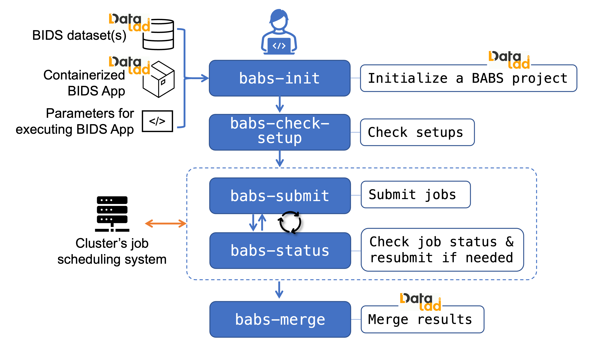

****************
Overview of BABS
****************

BIDS App Bootstrap (BABS) is a user-friendly and generalizable Python package
for reproducible image processing at scale.
BABS facilitates the reproducible application of BIDS Apps to large-scale datasets.

BABS features several command-line interface programs (highlighted in blue):

.. Note: we can use relative path here, as this rst file is in the docs/ folder.

:bdg-success:`Step I.` BABS requires three stuff as inputs:

1. DataLad dataset(s) of BIDS dataset(s). This could be raw BIDS data, or zipped results from another BABS project.
2. DataLad dataset of containerized BIDS App.
3. A YAML file regarding how the BIDS App should be executed.

Please refer to :doc:`preparation` for how to prepare them.

:bdg-success:`Step II.` The next step is to set up a BABS project.
With these three inputs, :doc:`babs init <babs-init>` initializes a BABS project.
It will clone input dataset(s) and containerized BIDS App. It will also
generate scripts that will later be used internally. These scripts will
complete the FAIRly big workflow framework. :doc:`babs check-setup <babs-check-setup>` will then
perform sanity checks and make sure the BABS project is ready for job running.
Details about BABS project initiation and checks are on this page: :doc:`create_babs_project`.

:bdg-success:`Step III.` The following step is to run the jobs for subjects (and sessions, if input is a multi-session dataset).
You can iteratively call :doc:`babs submit <babs-submit>` and :doc:`babs status <babs-status>` to submit jobs, check existing
jobs' status, and resubmit the jobs if failed or pending. To make it easy to handle large number
of jobs, :doc:`babs status <babs-status>` also checks the job status, audits outcomes of existing runs, and returns a summary.
Details about job submission and status checking are on this page: :doc:`jobs`.
The results for each subject (and session)
will be zipped and pushed to a remote indexed archive (RIA) store as a new branch.
Most importantly, all provenance is tracked by DataLad, including code (e.g., exact Singularity run command),
input BIDS dataset(s), the BIDS App, and results.

:bdg-success:`Step IV.` After all jobs have completed, you can use :doc:`babs merge <babs-merge>`
to merge results and provenance of successful jobs.
After you clone and unzip the results from the BABS project, they are ready to be consumed!
Details about results merging and consuming are on this page: :doc:`after_jobs`.

========
See also
========

* New users? Check out :doc:`docs of how to install BABS <installation>`
  and :doc:`example walkthrough <walkthrough>`!
* Having issues when using BABS? Please check out `BABS GitHub Issues page <https://github.com/PennLINC/babs/issues>`_
  to see if your questions have been covered. If not, please create a new issue.
* Want to contribute to BABS? Check out :doc:`docs for developers <developer>`!
