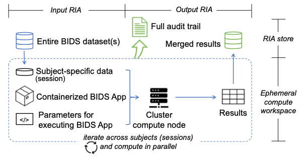

.. If changed this file, please also copy to `README.rst` in the root dir
    notice that, any paths need to be changed accordingly!

BABS: BIDS App Bootstrap
===============================

.. image:: https://readthedocs.org/projects/pennlinc-babs/badge/?version=latest
  :target: http://pennlinc-babs.readthedocs.io/en/latest/?badge=latest
  :alt: Documentation Status
.. image:: https://circleci.com/gh/PennLINC/babs/tree/main.svg?style=svg
  :target: https://circleci.com/gh/PennLINC/babs/tree/main

BIDS App Bootstrap (BABS) is a reproducible, generalizable, and
scalable python package for BIDS App analysis of large datasets.
It uses DataLad and adopts FAIRly big framework.

.. ^^ add `docs/source/` if in the README.rst in root dir!